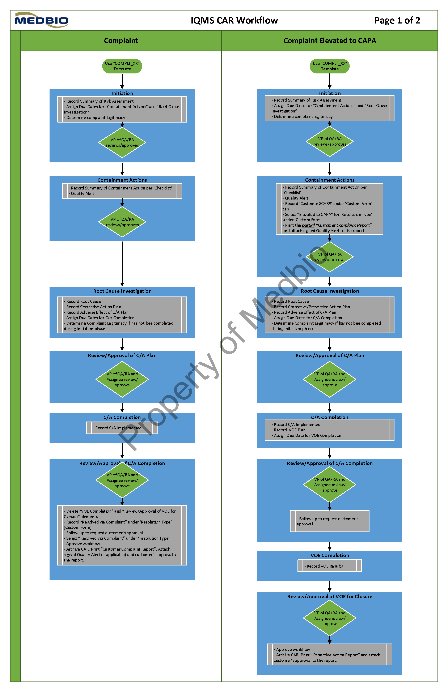
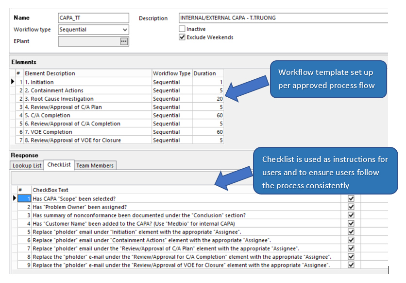
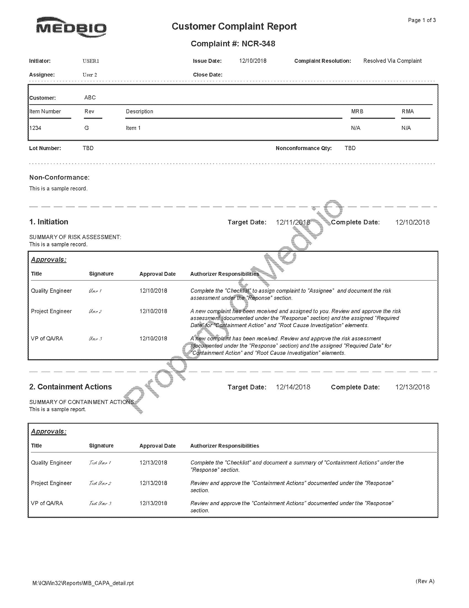
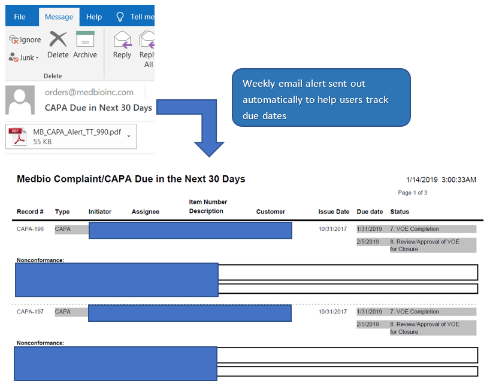

{:#heading-override}
### How I Solved the Problem:

{:#text-override-article }
1.	Met with stakeholders to develop business requirements for the new system.
2.	Created process flow diagram for the new process. 

3.	Presented and obtain approval for the new system design.
4.	Set up the workflow templates per the approved process flow. 
 
5.	Created reports using Crystal Report. 
 

6.	Created daily/weekly automatic alert to help users keep track of due dates. 
 
7.	Wrote and executed testing protocols.
8.	Created work instructions and trained users to the new system.

