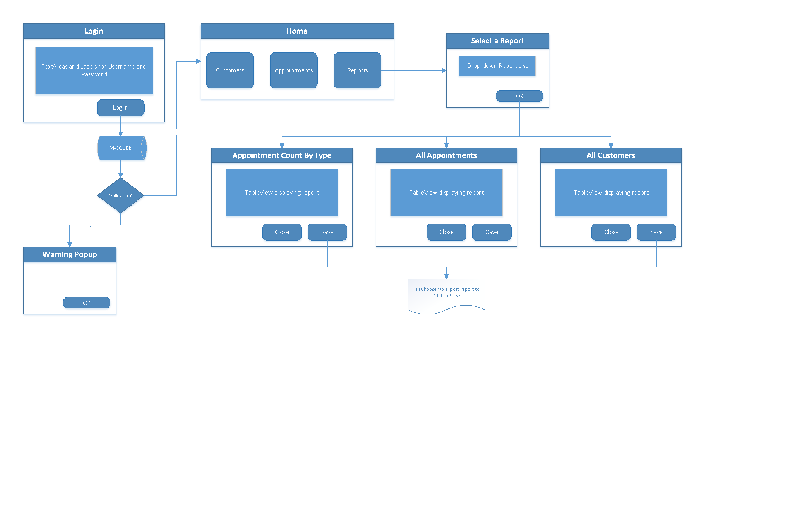
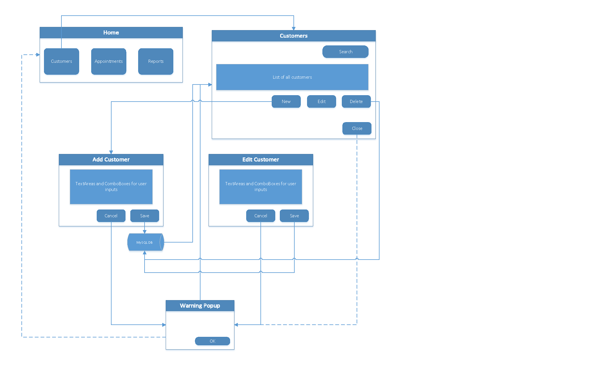
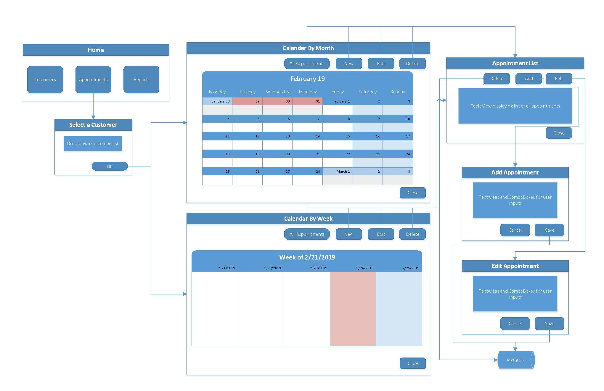
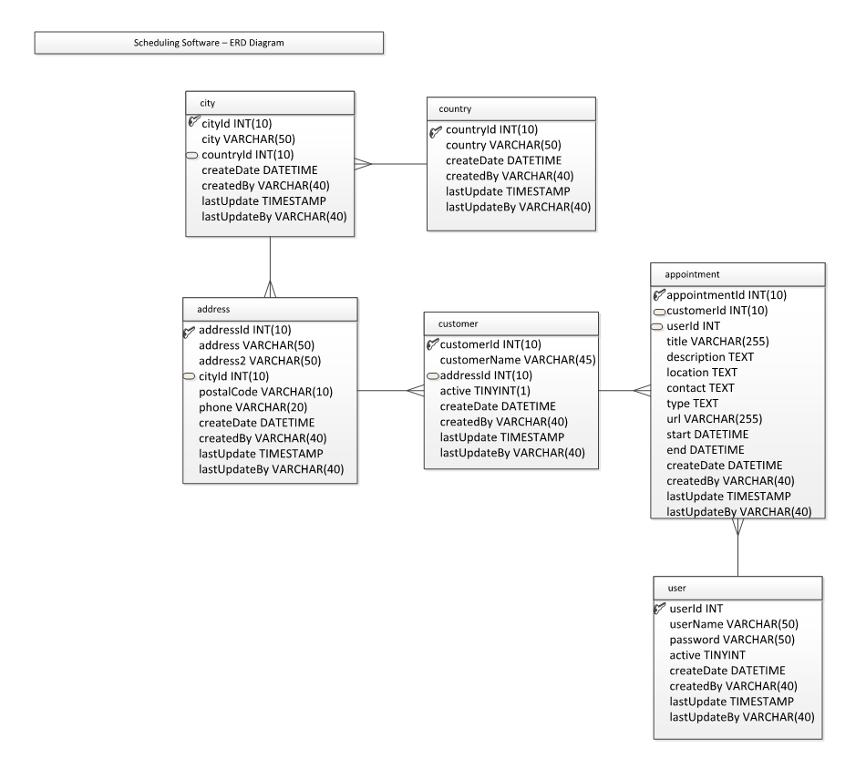

{:#heading-override}
### Design:

{:#text-override-article }
1.	I started the design process with a napkin-sketch of the GUI. 

2. I then put together a wireflow diagram, which was used throughout the coding process. 

3. The Entity Relationship Diagram (ERD) for the database design is shown below. 

4. The Model-View-Controller (MVC) design pattern was used to organize the source code for this application.

{:#heading-override}
### Execution:

{:#text-override-article }
1.	I started the execution phase with creating FXML code for all the GUI using Scene Builder.
- ***Challenge:*** Create a calendar view by month and by week using JavaFX.
- ***How I solved the problem:***
    - 

{:#heading-override}
### Final Product:

{:#text-override-article }
1.	I started the design process with my napkin-sketch of the GUI. 
